# Techionista Vendée Globe Business case
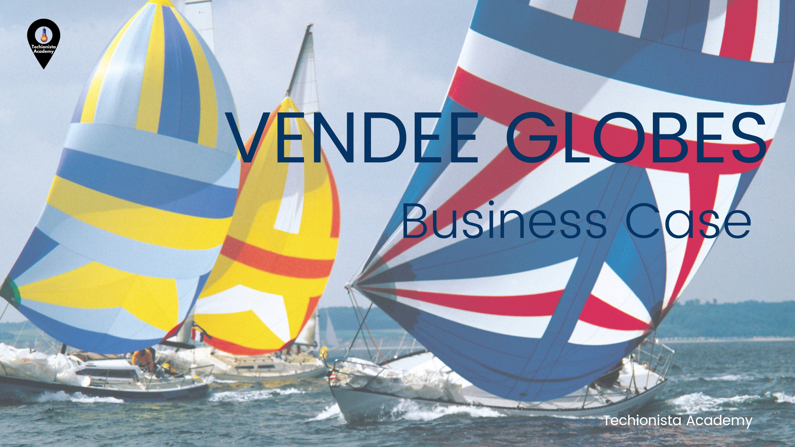

Welcome to the Techionista Vendée Globe Business Case!

The [Vendée Globe](https://en.wikipedia.org/wiki/Vend%C3%A9e_Globe) is a solo non-stop round the world yacht race founded by Philippe Jeantot in 1989. The race takes place every four years and is considered an extreme quest of individual endurance and the ultimate test in ocean racing.

The [9th edition](https://en.wikipedia.org/wiki/2020%E2%80%932021_Vend%C3%A9e_Globe) of the Vendee Globe was held in 2020-2021 and was won by French sailor [Yannick Bestaven](https://en.wikipedia.org/wiki/Yannick_Bestaven) who took slightly over 80 days to sail non-stop around the globe.

During the race, spectators could follow the action live on an online racing dashboard. The technology for tracking the boats live was provided by Nokia.

## Your challenge

In this business case, you will assume the role of Nokia. You will build a cloud-based [Lambda Architecture](https://en.wikipedia.org/wiki/Lambda_architecture) to process the telemetry data from the sailing boats. Your architecture should run in Azure and contain a real-time path for processing sailing boat data in real time, and a batch-processing path for collecting sailing boat data in batches and performing calculations on those batches. 

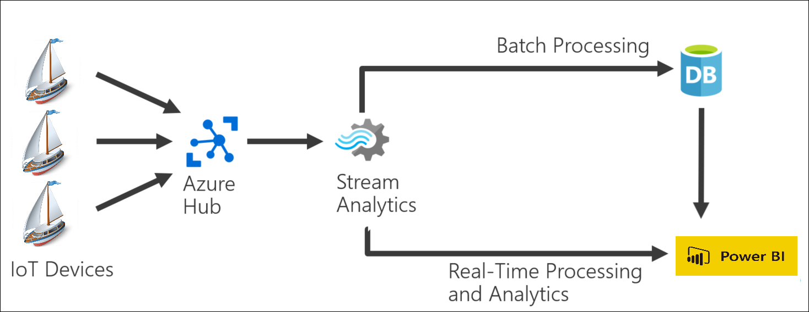

The Lambda Architecture should send all boat data to a PowerBI report. The report should display a world map with the current position of each boat, and a table with a ranking of racing teams. The ranking table should be sorted by who is currently in the lead. 

We are currently between races, so unfortunately we cannot use the actual data from the boats participating in the race. Instead, you are going to use a [Python application](./race_simulator.py) that will simulate boat telemetry data from a fleet of 10 race participants. 

To complete this business case, you will need to do the following:

1. Create a Lambda Architecture in Azure with a real-time path and a batch-processing path. Your architecture should include an Event Hub, a Stream Analytics Job, and an output to PowerBI. Your batch-processing path can use any data storage service you prefer: a Data Lake, a SQL Database, a Cosmos database, or a Synapse Analytics Workspace.
2. Create a PowerBI dashboard that displays a world map with the current location of each racing team, and a table with the teams ranked by position in the race.
3. Download the Python race simulation app to your local computer. Configure the app to send data to your EventHub.
4. Start the Python app. Every 60 seconds, the telemetry of the simulated racing boats will be sent to your Azure cloud.

You will have completed the business case if your PowerBI report correctly shows the position and ranking of each sailing team in the race.

Good luck!

## Getting started

To help you get started, here are guided instructions to build the first piece of the Lambda Architecture and get the Python sailing simulator up and running.

### How to create the Event Hub

The first thing you need to do is create an Event Hub Namespace in your Azure Tenant:

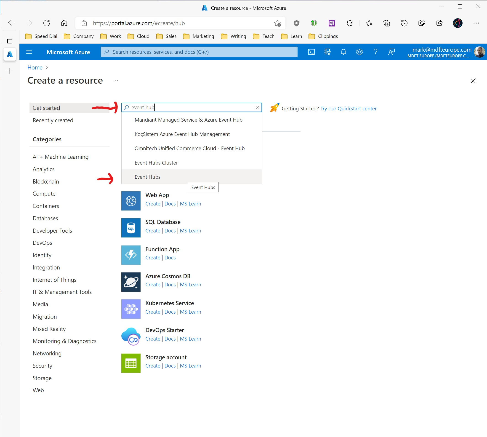

Then configure the Event Hub Namespace as follows:

* Subscription: select your Azure Pass Sponsorship
* Resource group: create a new resource group to hold all the resources of your Lambda Architecture. 
* Namespace name: choose a name for your namespace
* Location: select the region that's closest to your current location. This will be 'West Europe' if you're in the Netherlands.
* Pricing tier: set this to 'Basic'.
* Throughput Units: set this to 1.

Click the blue 'Review + Create' button at the bottom of the page, and then click the blue 'Create' button to create your Event Hub Namespace.

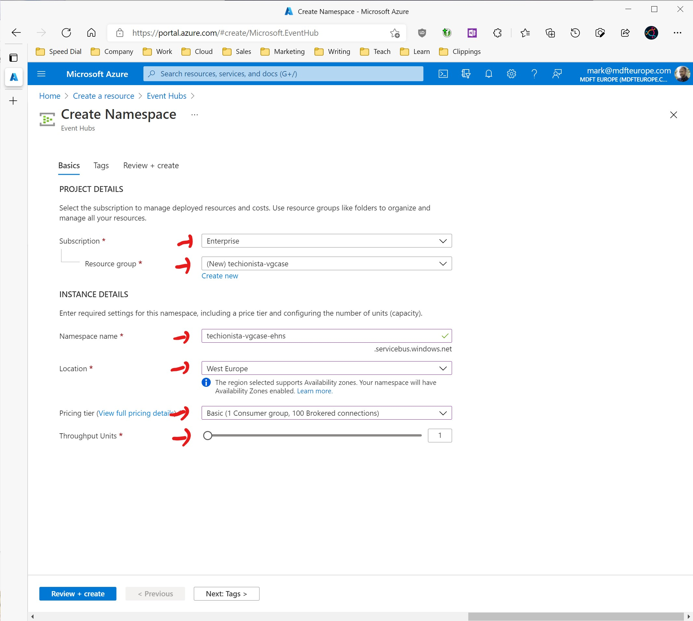

Once the Event Hub Namespace has been created, click on the blue 'Go to resource' button to access the Event Hub Namespace overview page.

From there, click on the '+ Event Hub' button to add a new Event Hub to the Event Hub Namespace:

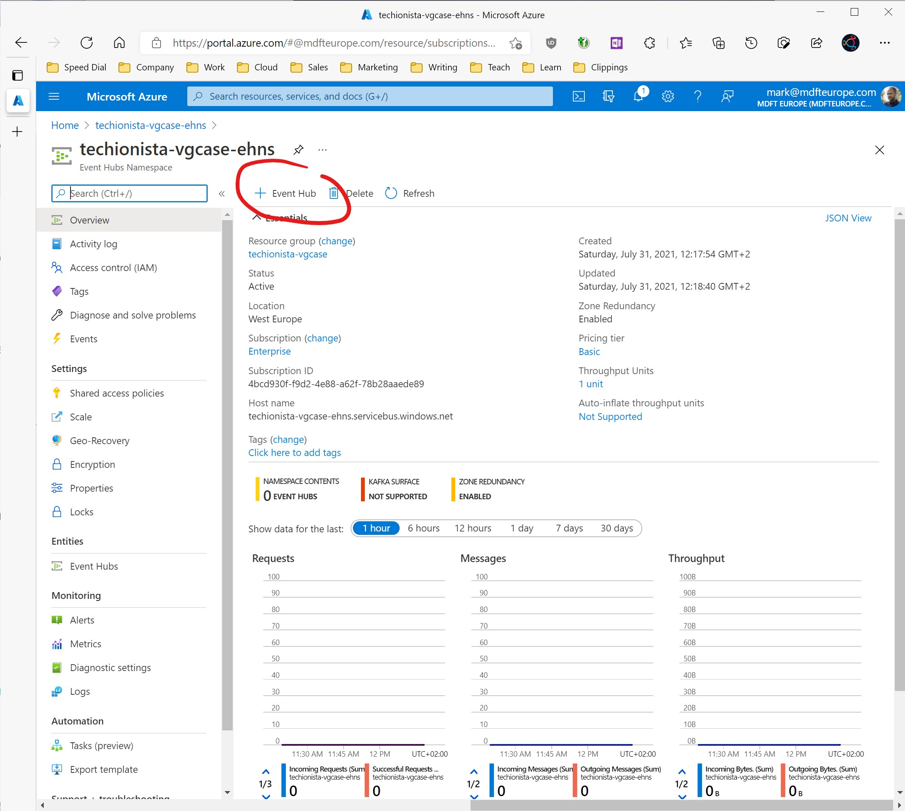

Configure the Event Hub as follows:

* Name: choose a name for your Event Hub.

**Store the Event Hub name in notepad**. You will need it in an upcoming installation step.

You can leave all other fields at their default value. Click the blue 'Create' button at the bottom of the page to create the Event Hub.

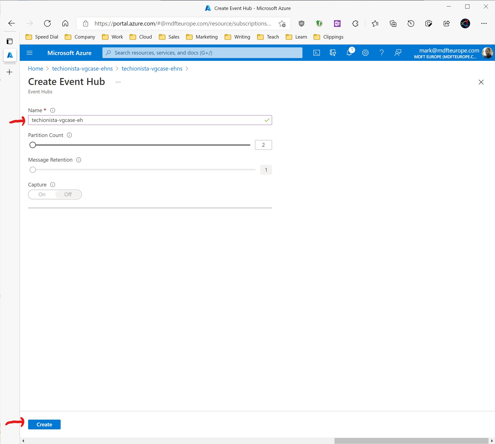

### How to get the Event Hub Namespace connection string

Next, you will need to create a Shared Access Policy that will allow the Python sailing simulator to send data to this Event Hub Namespace.

The Shared Access Policy will contain a connection string that the Python code will use to connect to the Event Hub and upload data to the Azure cloud.

First, make sure that you are on the Event Hub Namespace overview page, and then click the Shared Access Policies menu item.

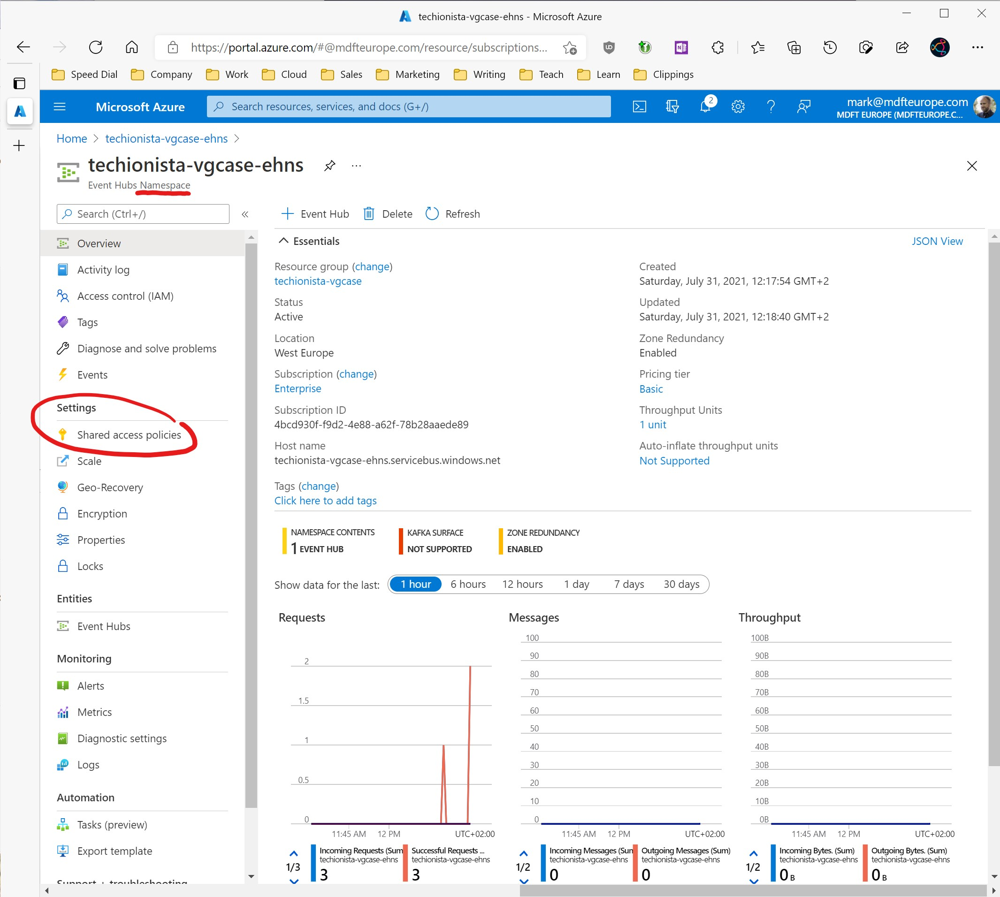

Now click the 'Add' button to add a new Shared Access Policy and provide the following information:

* Name: choose a name for your Shared Access Policy
* Send: check this box to allow sending new data to the Event Hub Namespace.

Leave the other options unchecked, and click the blue 'Create' button at the bottom of the page.

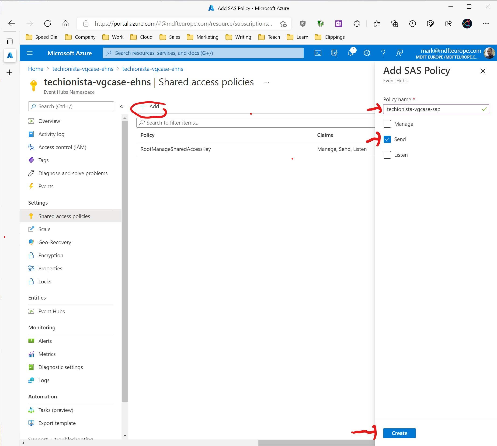

Once the Shared Access Policy has been created, select it from the list. Then use the copy button to copy the 'Connection String-Primary Key' value to your clipboard.

**Store the connection string in notepad**. You will need it in an upcoming installation step. 

### Download and configure the Python sailing simulator

We do not have access to the real boat telemetry data from the Vendée Globe participants, so instead we are going to use a Python application that will simulate boat telemetry data from a fleet of 10 race participants. 

First, make sure that [Python](https://www.python.org/downloads/) is installed on your computer. You can use either Windows, OS/X or Linux to run the sailing simulator.

Next, you need to install the Python library for Azure Event Hubs. Open a command line window and run the following command:

`pip install azure-eventhub
`

This will install the Azure Event Hub library for Python on your computer.

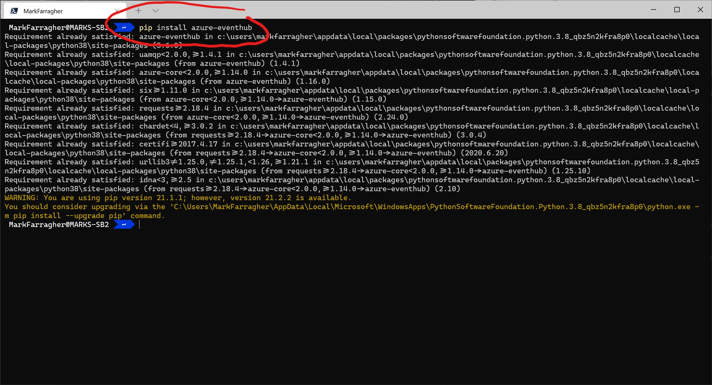

Now download the [Python Sailing Simulator](./race_simulator.py) and store it somewhere on your computer. 

Open the Python sailing simulator with your favorite text editor and take a look at lines 33 and 34. 

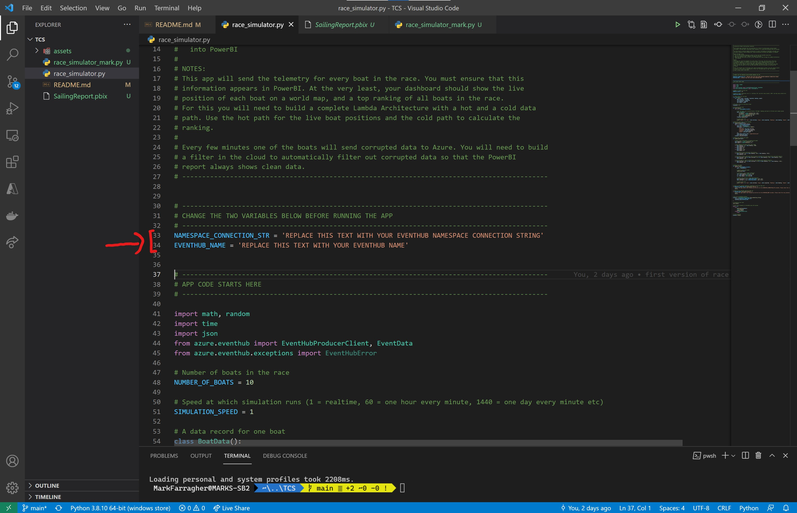

You must do the following:

* Replace the value of line 33 with the Connection String-Primary Key of your Event Hub Namespace. You saved this value in notepad earlier.
* Replace the value of line 34 with the name of your Event Hub. You saved this value in notepad earlier.

After you have made these replacements, your file should now look like this (keep in mind that the screenshot shows my specific configuration values, your values will be different):

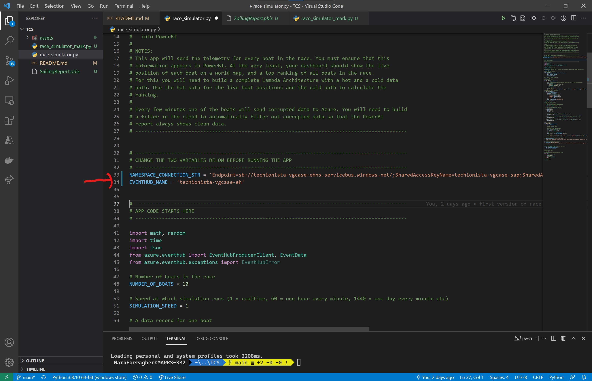

Save the file. You are now ready to run the simulator.

### Run the Python sailing simulator

Open a command line window and run the following command:

`python .\race_simulator.py
`

This will run the Python sailing simulator. The app will simulate a fleet of 10 sailing boats that start the race near the port of Cascais in Portugal and proceed south along the coast of Africa and then east towards Australia. 

While the app is running, it will display simluated boat telemetry data every 60 seconds:

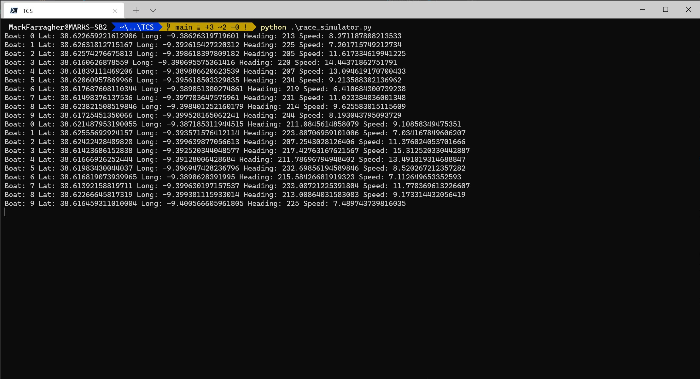

The race will continue for as long as you keep the app running. If you stop and restart the app, all sailing boats will reset back to their starting position in Portugal.

Keep the app running and check your Event Hub Namespace overview page. After approximately 5 minutes, the first data should appear in the monitoring graphs:

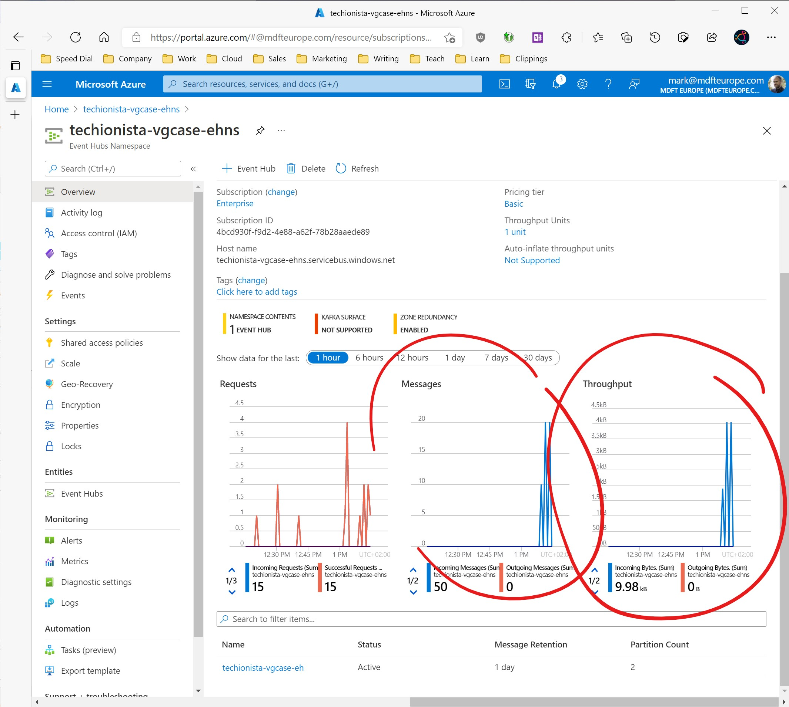

Congratulations! Your app is now working correctly and sending simulated race data to your Azure cloud.

## Next steps

To complete the business case, here's what you need to add:

* The remaining pieces of the Lambda Architecture: a Stream Analytics Job, an output to PowerBI, and a second output to a data storage service of your choice.
* A data storage service of your choice to store batch data: a Data Lake, a SQL Database, a Cosmos database, or a Synapse Analytics Workspace.
* A view or stored procedure or Synapse notebook to calculate the table of teans ranked by position in the race.
* A PowerBI dashboard that displays a world map with the current location of each racing team, and a table with the teams ranked by position in the race.

You will have completed the business case when your PowerBI report correctly shows the position and ranking of each sailing team in the race. The report should update live when new data arrives from the running Python sailing simulator.

## Challenges

During the business case, you will need to address several challenges:

* The Python app occasionally produces garbled data. How are you going to ensure that only clean data arrives in the PowerBI report? 
* How are you going to calculate the ranked list of sailing teams? How will you calculate who is ahead in the race?
* Which data service are you going to use for the batch-processing path in the Lambda Architecture?
* How will you present your data in the PowerBI report?

There are multiple solutions for each challenge.

## Bonus

If you want to impress us, try to adds some extra functionality to your PowerBI report that uses Machine Learning. For example, you could use Machine Learning to predict which racing team will be in the lead tomorrow, and show these predictions in your report.

This bonus is purely optional. Only spend time on this if you have already completed the main objectives of this business case and want to do a little bit extra. 

Good luck! We look forward to seeing your PowerBI dashboards!

