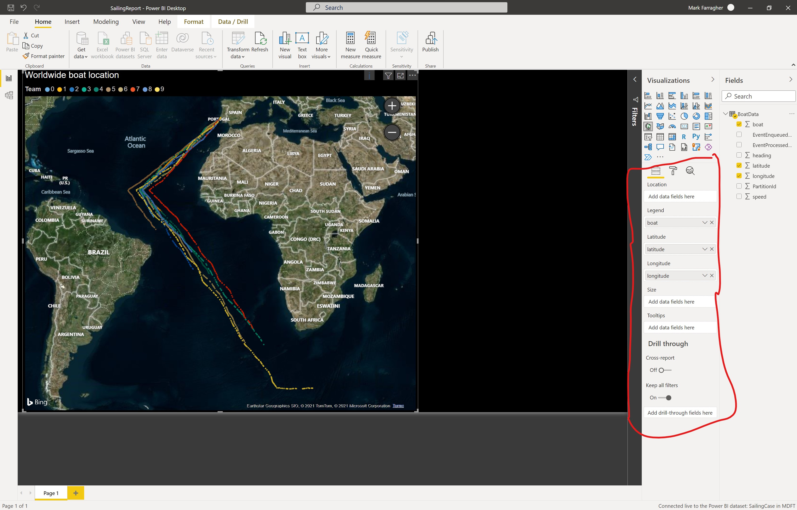

# A complete solution

If you get completely stuck and need some inspiration, feel free to check out this complete working solution for the business case. 

Needless to say, there are major spoilers below this point. Only continue reading if you're okay with that.

## The Lambda Architecture

This business case requires you to build a cloud-based [Lambda Architecture](https://en.wikipedia.org/wiki/Lambda_architecture) to process the telemetry data from the sailing boats. Your architecture will run in the Azure cloud and contain both a real-time path for processing sailing boat data, and a batch-processing path for collecting sailing boat data in batches and performing calculations on those batches. 

The picture identifies most of the Azure services you need to provision:

* An Event Hub for collecting sailing boat data
* A Stream Analytics Job for processing the data in real time
* A Power BI report for displaying the data
* A database for collecting data batches and preforming batch calculations

You can choose what kind of database you want to use for batch processing. The Azure SQL Database, Azure Cosmos DB and Azure Synapse Analytics will all work. 

In this solution, I will use Azure Synapse Analytics. 

## The Power BI report

The Power BI report needs to display at least two widgets:

* A world map with the current position of each sailing boat in the race. 
* A table with sailing boats ranked by position. The boat in the lead should appear at the top, the boat in second position should appear next, and so on. 

Here is a possible layout for the report:

The big widget on the left is a map visual that displays the real-time boat positions, and the widget on the right is a table visual that shows the calculated boat top-10 rankings throughout the race. 

And this is why you need to build a Lambda Architecture. The world map shows the boat positions in real time, so you need a real-time path to feed the data into Power BI as quickly as possible.

But the table shows the boat top-10 rankings. You cannot calculate these rankings from the real-time data. Because how would you tell which boat is in the lead? Is it the boat the furthest south? The furthest east? That simply will not work.

To calculate boat rankings, you have to collect every position of the boat since the start of the race (this is the 'batch') and then use an analytical query to calculate which boat is in the lead. 

So you'll also need the slow path or batch processing path to perform this calculation, and forward the results into Power BI for display.

**Alternate solution:** 

If you want, you can also feed the real-time data into Power BI and then perform the ranking calculation from within Power BI. In this solution you're still using a Lambda Architecture, but now you're using Power BI for both the real-time and the batch processing path. 

## The data from the Python app

The Python app simulates a race with 10 sailing boats. The race starts in the south of Portugal close to the port city of Cascais. The boats start moving to the south-west to follow the African coast, then head south all the way down to the Antarctic coast where they make a right turn and continue east towards Australia. 

The app displays the position of each boat every 60 seconds. When running, it looks like this:

The app displays the latitude, longitude, heading and speed of each of the 10 boats in the race. The heading is in degrees and the speed is in kilometers per hour.  

Every once in a while (roughly once every 100 updates), this will happen:

One of the boats is incorrectly reporting its position as -10000 longitude and -10000 latitude. This is clearly incorrect. 

We must make sure this data never reaches the Power BI report, because it would mess up the boat track on the world map. 

## Building the Real-Time path

The easiest way to start is by building the real-time path of the Lambda Architecture, like this:

Event Hub ---> Stream Analytics Job ---> Power BI

We already have the Event Hub working, so all we need to do is add the analytics job and configure it to send its output into a Power BI model.

Log in to the Azure portal with your Azure account, click on the search field in the blue bar at the top of the page, and type 'Stream Analytics jobs':

Then, on the Stream Analytics Jobs overview page, click the CREATE button to create a new job. 

Provide the following information:

* The name of the Stream Analytics job
* The subscription to use. Select your Azure Pass subscription from the dropdown list.
* The resource group to use. Select the same resource group as where you created the Event Hub.
* The region to use. Select the region closest to you from the dropdown list.
* The hosting environment. We're going to use the Cloud environment for this business case.
* The humber of Streaming Units. Select the default value of 3. 

Then click the blue CREATE button to start provisioning the Stream Analytics job.

After the Stream Analytics job has been created, go to its overview page. Then click the INPUTS menu option in the menu bar on the left, and add a new Event Hub input:

In the Event Hub New Input panel, provide the following information:

* Input alias: type a name for this input, for example 'eventHub'
* Then click: 'Select Event Hub from your subscription'
* Subscription: select your Azure Pass subscription from the dropdown list
* Event Hub Namespace: select your Event Hub namespace from the dropdown list
* Event Hub name: Click 'Use existing' and select the Event Hub from the dropdown list
* Event Hub consumer group: Click 'Use existing' and select '$Default' from the dropdown list
* Authentication mode: select 'Connection string' from the dropdown list
* Event Hub policy name: click 'Use existing' and select 'RootManageSharedAccessKey' from the dropdown list. This is a built-in shared access policy that provides full access to the Event Hub.
* Event serialization format: make sure this is set to JSON

Then click the blue SAVE button to create the job input.

**WARNING: Power BI Pro required**

For the next step, you will need a Power BI Pro account. A Power BI Pro Trial will also work, but not a regular Power BI account. If you don't have a pro account, please keep reading for a workaround.  

Now click the OUTPUTS menu option in the menu bar on the left, and add a new Power BI output:

In the Event Hub New Output panel, provide the following information:

* Output alias: type a name for this output, for example 'powerBI'
* Then click: 'Select Group workspace from your subscription'
* Group workspace: select the Power BI workspace you want to use from the dropdown list
* Authentication mode: select 'User token' from the dropdown list
* Dataset name: type the name of the Power BI dataset to create. I used 'SailingCase'.
* Table name: type the name of the Power BI table to create. I used 'BoatData'.
* Click the blue AUTHORIZE button to log in to Power BI and authorize Stream Analytics to access the Power BI dataset.

After you have completed authorization, click the blue SAVE button at the bottom of the panel to create the job output.

You now have a job that reads all events from the Event Hub and writes all output directly to Power BI. All that remains is to set up the transformation query and start the job. 

Now click QUERY and type the following query in the query panel:

`
SELECT
    *
INTO
    [powerBI]
FROM
    [eventHub]
WHERE
    latitude >= -180 AND longitude >= -180
`

Notice the WHERE part that filters out the invalid longitude and latitude values of -10000 that are sometimes generated by the sailing boats.

Now go back to the overview page of the Stream Analytics job and click the START button in the toolbar near the top of the page. 

This will start the job. You'll get a confirmation after about a minute that the job was started successfully.

At this point the job is running. It is reading all sailboat data from the Event Hub, filtering out any invalid longituded and latitude values, and sending the output directly into Power BI in the BoatData table of the SailingCase dataset.

**Alternate solution**

If you don't have a Power BI Pro account and can't get a Pro Trial account, you'll have to find another way to get the sailing boat data into Power BI.

One possible solution is to set up a blob storage account and write the data into this account as parquet files. Then you can load these files manually in Power BI. 

To set up a blob storage output, go to the OUTPUTS page of the Stream Analytics job and add a Blob storage/ADLS Gen2 output:

In the Event Hub New Output panel, provide the following information:

* Output alias: type a name for this output, for example 'powerBI'
* Then click: 'Select Blob storage/ADLS Gen2 from your subscription'
* Subscription: select your Azure Pass subscription from the dropdown list
* Storage account: select your blob storage account from the dropdown list
* Container: click 'Use existing' and select the storage container you want to use from the dropdown list
* Authentication mode: select 'Connection string' from the dropdown list
* Path pattern: leave this field blank
* Event serialization format: set this field to 'Parquet'

Then click the blue SAVE button at the bottom of the panel to create the job output.

You now have a job that reads all events from the Event Hub and writes all output directly to a storage account container as Parquet files. 

Note that this output has a different name, so you'll also have to change the transformation query to:

`
SELECT
    *
INTO
    [blobStorage]
FROM
    [eventHub]
WHERE
    latitude >= -180 AND longitude >= -180
`

Note the part `... INTO [blobStorage]...` that refers to the name of the blob storage output we just created. The input and output names must match exactly with the references in the SQL query, or the job will not work correctly.

Your next step is to open Power BI and create a new report that imports the Parquet data into a Power BI dataset. I'll leave this as an exercise for the reader ;) 

## Building the Map visual in Power BI

Assuming you do have a Power BI Pro account, your next step is to present the real-time boat data in Power BI on a world map. 

Open Power BI and drag a map visual onto the report designer and configure it as follows:

* Legend: boat (from the BoatData table)
* Latitude: latitude (from the BoatData table)
* Longitude: longitude (from the BoatData table)

If you left the Python app running for long enough, the 10 boat tracks should appear on the map.

Cogratulations! At this point the real-time part of the business case is all done. You have created a Power BI report that updates live with boat data and shows the actual position of each boat on a world map. 

Next, we need to build the batch processing path. 

## Building the Batch Processing path

For the batch processing path, we need to store all of the boat data into some kind of database for further analysis. I will use Synapse Analytics in this solution. 

Go to the Azure portal and create a new Synapse Analytics service. Configure the service as follows:

* Subscription: select the name of your Azure Pass subscription from the dropdown list
* Resource group: select the resource group you've been using for this business case from the dropdown list
* Managed resource group: leave this field empty
* Workspace name: type a name for your Synapse workspace
* Region: select the region closest to your location
* Select Data Lake Storage Gen2: click 'From subscription' 
* Account name: click 'Create new' and type a name for the primary data lake that will be created. I used 'mdftsailingcasedlake'.
* File system name: click 'Create new' and type a name for the storage container that will be created. I used 'workspace'.

Click the blue REVIEW+CREATE button and then the CREATE button to provision Synapse Analytics. 

After the setup has completed, you will have a new Synapse Analytics service plus a primary data lake called 'mdftsailingcasedlake' (or whatever name you provided during setup). 

We're now going to configure the Stream Analytics job to write all boat data into the primary data lake. We can then use a serverless SQL pool in Synapse to calculate the top-10 ranking of the sailing boats, and export this information to Power BI for display.

So now please go back to the Stream Analytics page, select the OUTPUTS menu option from the menu on the left, and then add a new Blob storage/ADLS Gen2 output.

In the Event Hub New Output panel, provide the following information:

* Output alias: type a name for this output, for example 'dataLake'
* Then click: 'Select Blob storage/ADLS Gen2 from your subscription'
* Subscription: select your Azure Pass subscription from the dropdown list
* Storage account: select the primary data lake that was created during the Synapse Analytics installation
* Container: click 'Use existing' and select the 'workspace' container that was created during the Synapse Analytics installation
* Authentication mode: select 'Connection string' from the dropdown list
* Path pattern: type the following pattern: `sailingdata/year={datetime:yyyy}/month={datetime:MM}/day={datetime:dd}`
* Event serialization format: set this field to 'Parquet'

Then click the blue SAVE button at the bottom of the panel to create the job output.

The path pattern we used will store all boat data into the primary datalake in a folder called 'sailingdata'. Below this folder are 3 subfolders for the year, month and day, and the day folder will contain a collection of Parquet files with all sailing data for that day. 

The final step to get this to work is to update the transformation query to accomodate the new output we just added. 

Go to the QUERY page of the Stream Analytics job and change the transformation query to:

`
SELECT
    *
INTO
    [blobStorage]
FROM
    [eventHub]
WHERE
    latitude >= -180 AND longitude >= -180
`

`
SELECT
    *
INTO
    [dataLake]
FROM
    [eventHub]
WHERE
    latitude >= -180 AND longitude >= -180
`

This is just the same query repeated twice, but with different outputs. This new query will read all boat data from the Event Hub and write the data to both Power BI and the Synapse Analytics primary data lake.

At this point, wait a couple of minutes with the Python application running so that the data lake slowly fills up with new data.

## Accessing the batch data in Synapse Analytics

We're now ready to calculate the top-10 ranking. Go to the Synapse Analytics workspace and click on the DATA menu option in the menu on the left. 

Make sure the LINKED tab is selected. Then expand the primary datalake and click on the workspace container. In the pane on the right, double click the 'sailingdata' folder.

Keep double-clicking folders until you reach the lowest level and seeing Parquet files. Then right-click a Parquet file (doesn't matter which one) and select 'Create external table' from the context menu.

In the panel on the right, fill in the following information:

* Select SQL pool: Built-in
* Select a database: select +New from the dropdown list and then type the name 'sailing' to create a new serverless database for the external table
* External table name: type the name 'sailingdata'
* Create external table: click 'Using SQL script'

And click the blue CREATE button to create the SQL script.

A new query window will appear with all the SQL queries to set up the external table. Don't run these queries right away, because we need to make a modification first. 

Go to the `LOCATION = ` line of the `CREATE EXTERNAL TABLE` query and modify the location to 'sailingdata/**'. This will instruct Synapse to load every single Parquet file in the datalake, not just the one that we clicked on a minute ago.

With this modification in place, click the RUN button in the toolbar near the top of the page. 

The queries will run and set up a new external table called 'sailingdata' that references all boat data stored in the primary datalake in the folder 'sailingdata' as Parquet files.

You'll see the results of the final query appear. This is simply the first 100 records in the new 'sailingdata' external table.

## Calculating the top-10 ranking

Now we're going to make a query to calculate the top-10 ranking of the boats in the sailing race.

Each data record describes the position and speed of a single boat, with the speed expressed in kilometers per hour. The records are uploaded every 60 seconds. 

A very quick and dirty way to calculate the ranking is to simply calculate the total distance travelled by each boat, and assume the boat that travelled the furthest is in the lead position.

We know the speed of each boat in kilometers per hour. If we divide this number by 60, we get the speed in kilometers per minute. The boat speed is recorded every minute, so in between two data records each boat travels a distance in kilometers of approximately its speed divided by 60.

We can calculate the distance travelled for each boat by grouping by boat number and then summing the speed divided by 60. 

The following Synapse Analytics query will do so:

The query is:

`
SELECT		[boat],
			SUM([speed]/60) AS distance,
			COUNT([speed])/60.0 AS hours
FROM 		[sailingdata]
GROUP BY	[boat]
ORDER BY	distance DESC
`

This will produce a sorted list of boats, with the boat that has travelled the furthest on top, the second furthest boat coming next, and so on. There's also an `hours` column with the total number of hours that the boat has been in the race. This number is of course the same for all 10 boats.

The last step is to store this top-10 list in a new Parquet file in the primary datalake. For this, we're going to need a new external table.

Empty the contents of the query window and then paste the following sequence of queries:

`
CREATE EXTERNAL FILE FORMAT [BoatRankingParquetFormat] 
WITH ( FORMAT_TYPE = PARQUET)
`

`
CREATE EXTERNAL DATA SOURCE [BoatRankingDataLake] 
WITH (
	LOCATION = 'https://mdftsailingcasedlake.dfs.core.windows.net/workspace'
)
`

`
CREATE EXTERNAL TABLE boatranking
	WITH (
	LOCATION = 'sailingdata/boatranking',
	DATA_SOURCE = [BoatRankingDataLake],
	FILE_FORMAT = [BoatRankingParquetFormat]
	)
AS
`

`
SELECT	[boat],
			SUM([speed]/60) AS [distance],
			COUNT([speed])/60.0 AS [hours]
FROM 		[sailingdata]
GROUP BY	[boat]
ORDER BY	distance DESC
`

This sets up a new external table called `boatranking`, runs the ranking query, and copies the query results over into the external table. The data will be stored in the 'sailingdata/boatranking' folder of the primary data lake as a series of Parquet files.

To check if everything got saved correctly, we can head over to the primary data lake and look up the 'sailingdata/boatranking' folder. 

The folder should contain a single Parquet file. Right-click this file and select 'Select TOP 100 rows' from the context menu.

Now run the resulting query. You should see the boat ranking appear, with the distance travelled for each boat in the race.

At this point we're done with the batch processing path of the Lambda Architecture. We have stored all real-time data in the primary data lake of Synapse Analytics, used an external table from the serverless SQL pool to load the data, ran an analysis query to calculate the distance travelled for each boat, and saved the results back to the data lake using a second external table and the CREATE EXTERNAL TABLE AS SELECT command.

Now all that remains is for us to import the Parquet file with the boat rankings into Power BI and show it in a table next to the world map.

## Adding boat rankings to Power BI

TODO
